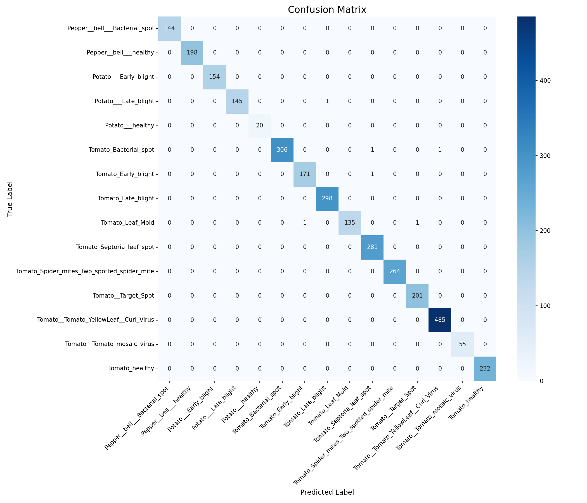
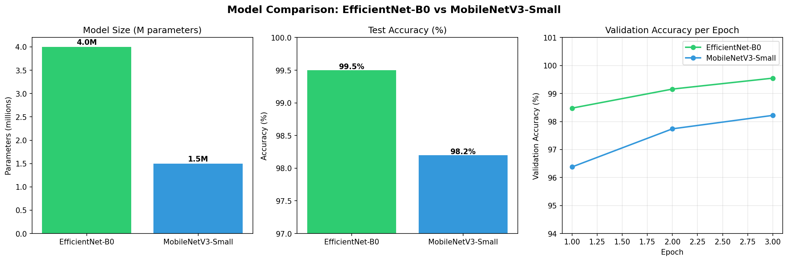
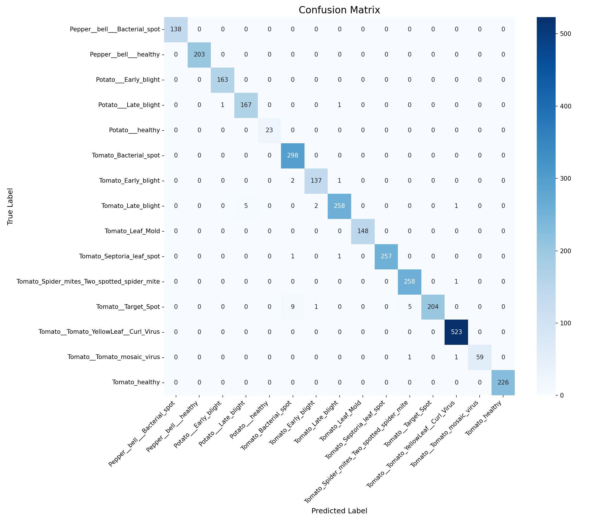

# 🌿 Plant Disease Classifier

A computer vision project for automated plant disease detection using transfer learning with EfficientNet-B0 and PyTorch.

Trained on the [PlantVillage dataset](https://www.kaggle.com/datasets/emmarex/plantdisease)(Hughes & Salathé, 2015), 
which contains 41,000+ labeled images across 15 classes of healthy and diseased plant leaves 
(pepper, potato, and tomato).


---

## Why This Project

Plant diseases are responsible for significant crop losses worldwide, threatening both 
food security and agricultural productivity. Early and accurate detection is critical — 
but manual inspection by agronomists is slow, expensive, and difficult to scale across 
large growing operations.

Computer vision offers a scalable alternative: a model that can classify plant diseases 
from leaf images in milliseconds, directly supporting decisions in the field or greenhouse.
This project demonstrates a full pipeline from raw image data to an interactive web 
application — including model interpretability via Grad-CAM.

---

## Demo

Upload a leaf image to the Streamlit app and get:
- Disease classification with confidence score
- Grad-CAM heatmap showing where the model focused
- Top-3 predictions with probabilities
- Disease background information

```bash
streamlit run app.py
```

---

---

## Installation

```bash
# Clone the repo
git clone https://github.com/Arashi20/PlantDisease_Classification.git
cd PlantDisease_Classification

# Create virtual environment
python -m venv venv
venv\Scripts\activate        # Windows
# source venv/bin/activate   # macOS/Linux

# Install PyTorch (CPU)
pip install torch torchvision --index-url https://download.pytorch.org/whl/cpu

# Install remaining dependencies
pip install -r requirements.txt
```

**Dataset:** Download the [PlantVillage dataset](https://www.kaggle.com/datasets/emmarex/plantdisease) 
from Kaggle and place it in `data/raw/PlantVillage/`.

---

## Usage

**Train the model:**
```bash
python src/train.py
```

**Evaluate on test set:**
```bash
python src/evaluate.py
```

**Single image inference:**
```bash
python src/inference.py --image path/to/leaf.jpg
```

**Launch the web app:**
```bash
streamlit run app.py
```

---

## Model & Technical Choices

### Architecture: EfficientNet-B0

EfficientNet (Tan & Le, 2019) scales network depth, width, and resolution using a 
compound coefficient — achieving strong performance at a fraction of the parameters 
of older architectures like VGG or ResNet. B0 is the smallest variant, making it 
well-suited for CPU inference and edge deployment.

### Transfer Learning

Training a CNN from scratch requires millions of labeled images and significant compute. 
By using EfficientNet-B0 pretrained on ImageNet, the model already understands low-level 
visual features — edges, textures, color gradients — before seeing a single leaf image. 
Only the final classification layer is replaced and fine-tuned for our 15 plant disease classes.

This approach is standard practice in production computer vision, especially in domains 
where labeled data is limited.

### Data Augmentation

To improve generalization and robustness to real-world variation:
- Random horizontal flips
- Random rotation (±15°)
- Color jitter (brightness & contrast ±20%)

Validation and test sets use only resizing and normalization — no augmentation.

### Training Configuration

| Parameter | Value |
|-----------|-------|
| Optimizer | Adam |
| Learning rate | 1e-4 |
| Batch size | 32 |
| Epochs | 3 |
| Image size | 224×224 |
| Loss function | CrossEntropyLoss |

---

## Results

| Metric | Score |
|--------|-------|
| Test Accuracy | **99.5%** |
| Macro Precision | **1.00** |
| Macro Recall | **1.00** |
| Macro F1 | **1.00** |

The model achieves near-perfect classification across all 15 classes after just 3 epochs 
of fine-tuning on CPU — demonstrating the efficiency of transfer learning for domain-specific 
image classification tasks.

### Confusion Matrix



The confusion matrix shows near-perfect diagonal alignment across all 15 classes. 
Total misclassifications on the test set: fewer than 5 out of 3,095 samples.

---

## Model Comparison

To evaluate the accuracy-efficiency tradeoff, EfficientNet-B0 was benchmarked against 
MobileNetV3-Small — a lightweight architecture designed for edge deployment.

| | EfficientNet-B0 | MobileNetV3-Small |
|---|---|---|
| Parameters | 4.0M | 1.5M |
| Test Accuracy | 99.5% | 98.2% |
| Misclassifications | <5 / 3,095 | ~35 / 3,095 |
| Val Accuracy (Epoch 1) | 98.5% | 96.4% |



**Key takeaway:** MobileNetV3-Small achieves 98.2% accuracy with 62% fewer parameters. 
EfficientNet-B0 converges faster and handles visually similar diseases more accurately — 
particularly `Tomato__Target_Spot` vs `Tomato_Bacterial_spot`. For edge deployment 
scenarios (greenhouse cameras, mobile devices), MobileNetV3-Small offers a compelling 
tradeoff. For high-precision diagnosis, EfficientNet-B0 remains the stronger choice.




## Model Interpretability: Grad-CAM

Gradient-weighted Class Activation Mapping (Selvaraju et al., 2017) visualizes which 
regions of an input image most influenced the model's prediction by computing gradients 
of the class score with respect to the final convolutional feature maps.

### Key observations

**Diseased leaves:** The model focuses tightly on lesion areas — the specific spots, 
rings, or discoloration patterns characteristic of each disease. This confirms the model 
is learning disease-relevant features, not spurious correlations.

**Healthy leaves:** The model distributes attention more broadly across the leaf surface — 
consistent with the absence of localized pathological features.

**Limitation:** On some images, the model focuses on a single dominant lesion rather 
than all affected areas. In early-stage infections with small, dispersed spots, this 
could reduce confidence. This is a known limitation of classification-only architectures 
and motivates future work on detection or segmentation approaches (e.g., YOLO, Mask R-CNN).

---

## Limitations & Real-World Considerations

PlantVillage is a controlled laboratory dataset — images are taken under consistent 
lighting with clean backgrounds. In field conditions, performance may degrade due to:

- Variable lighting, shadows, and reflections
- Cluttered backgrounds (soil, other plants)
- Partial leaf visibility or motion blur
- Early-stage infections with subtle symptoms
- Multiple diseases present on a single leaf

Adapting this model for production use would require fine-tuning on field-collected 
images representative of actual growing conditions, and likely a preprocessing step 
to isolate the leaf from its background.

---

## Dataset

[PlantVillage Dataset](https://www.kaggle.com/datasets/emmarex/plantdisease)

- 41,000+ labeled images
- 15 classes across 3 crop types: pepper, potato, and tomato
- Covers 14 distinct diseases + healthy class

---

## References

- Tan, M., & Le, Q. (2019). *EfficientNet: Rethinking Model Scaling for Convolutional Neural Networks.* ICML.
- Selvaraju, R. et al. (2017). *Grad-CAM: Visual Explanations from Deep Networks via Gradient-based Localization.* ICCV.
- Hughes, D., & Salathé, M. (2015). *An open access repository of images on plant health to enable the development of mobile disease diagnostics.* arXiv:1511.08060.